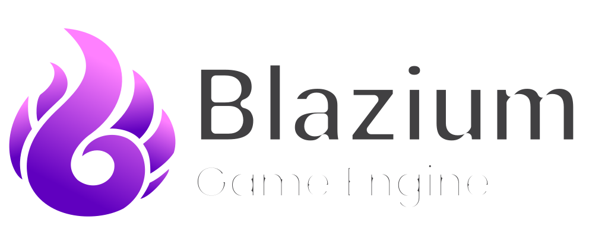

# Blazium Engine

  

## 2D and 3D cross-platform game engine

**[Blazium Engine](https://blazium.app) is a feature-packed, cross-platform
game engine to create 2D and 3D games from a unified interface.** It provides a
comprehensive set of common tools, so that
users can focus on making games without having to reinvent the wheel. Games can
be exported with one click to a number of platforms, including the major desktop
platforms (Linux, macOS, Windows), mobile platforms (Android, iOS), as well as
Web-based platforms.

## Free, open source and community-driven

Blazium is completely free and open source under the very permissive [MIT license](https://mit-license.org).
No strings attached, no royalties, nothing. The users' games are theirs, down
to the last line of engine code. Blazium's development is fully independent and
community-driven, empowering users to help shape their engine to match their
expectations.

Before being open sourced in [February 2014](https://github.com/godotengine/godot/commit/0b806ee0fc9097fa7bda7ac0109191c9c5e0a1ac),
Godot had been developed by [Juan Linietsky](https://github.com/reduz) and
[Ariel Manzur](https://github.com/punto-) for several years as an in-house
engine, used to publish several work-for-hire titles.

Blazium was forked from Godot in [October 2024](https://github.com/blazium-games/blazium/commit/e86a91030a60be7d37e99c7a6069d75181d5138c),
intending to improve upon Godot in order to fulfill its potential and contribute to the shared
codebase of both through a more genuinely community-driven model.

## Migrating from Godot

Blazium strives to maintain a high level of compatibility with projects made using Godot.
Switching should be rather straightforward, as even GDExtensions are compatible.
Opening a project made with Godot 4.3 using a Blazium build based on Godot 4.3 should work with no additional steps.
Blazium's fallback theme differs slightly from Godot's, but this has not been found to interfere with any projects so far.

## Getting the engine

### Binary downloads

Official binaries for the Blazium editor can be found [on the Blazium website](https://blazium.app/download/prebuilt-binaries)

### Compiling from source

[See the upstream docs](https://docs.godotengine.org/en/latest/engine_details/development/compiling)
for compilation instructions for every supported platform.

## Community and contributing

Blazium is not only an engine but an ever-growing community of users and engine developers.

The best way to get in touch with the core engine developers is to join the
[Official Discord Server](https://chat.blazium.app).

To get started contributing to the project, see the [contributing guide](CONTRIBUTING.md).
This document also includes guidelines for reporting bugs.

